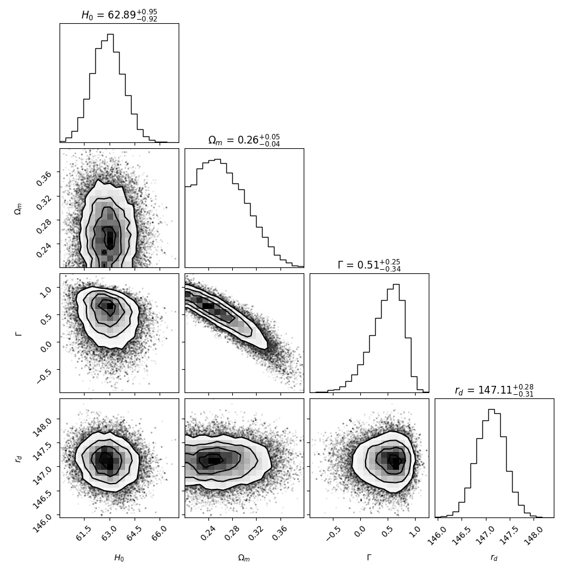
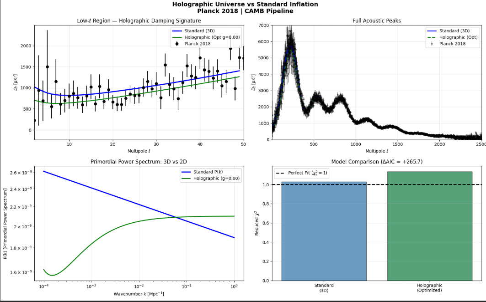
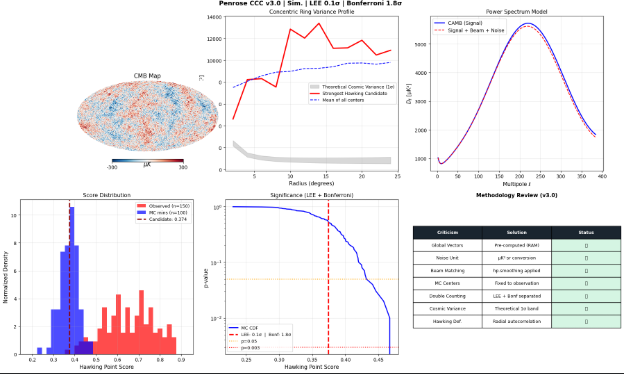

# AstroData-Testing-Pipeline: A Multi-Stage Cosmological Data Analysis Pipeline


An advanced computational framework for testing fundamental cosmological hypotheses using multi-messenger open data (CMB, Supernovae, Gravitational Waves, and LHC Open Data).

##  Project Overview

This project implements a robust statistical and computational pipeline to evaluate the limits of the **Standard Cosmological Model (ΛCDM)** against alternative theories such as Dynamic Dark Energy, Extra-Dimensional Gravity, and Conformal Cyclic Cosmology (CCC).

##  Technical Stack

* **Physical Engines:** `CAMB` (Einstein-Boltzmann solver), `PyCBC` (Gravitational wave informatics).
* **Data Processing:** `Healpy` (HEALPix spherical mapping), `Uproot` & `Awkward` (ROOT file processing), `Pandas`, `NumPy`.
* **Statistical Inference:** `Emcee` (MCMC), `SciPy` (Optimization), `Akaike/Bayesian Information Criteria (AIC/BIC)`.

---

##  Analysis Stages

### Stage 1: Dynamic Dark Energy Model Selection
**Scientific Goal:** Testing for deviations from the cosmological constant (Λ) using a dynamic Equation of State parameter (Γ).
* **Dataset:** Pantheon+ (1590 Type Ia Supernovae) & SDSS DR12 BAO.
* **Methodology:** Bayesian inference via MCMC with analytical marginalization over M_B.

### Stage 2: Multi-Messenger Gravity Leakage Test
**Scientific Goal:** Constraining the "leakage" of gravitational waves into extra dimensions.
* **Dataset:** LIGO GW150914 Strain Data + SN + BAO.
* **Methodology:** Waveform damping analysis and signal-to-noise ratio (SNR) consistency checks via joint MCMC.

### Stage 3: LHC High-Energy MET Anomaly Detection
**Scientific Goal:** Searching for Missing Transverse Energy (MET) as a proxy for extra-dimensional particle decay.
* **Dataset:** CERN ATLAS 13 TeV Monojet Open Data.
* **Methodology:** High-dimensional phase-space analysis and background estimation using ROOT/Uproot.

### Stage 4: Primordial Power Spectrum Dynamics
**Scientific Goal:** Modeling early universe leakage by adjusting the effective number of relativistic species (N_eff) and Dynamic Dark Energy.
* **Methodology:** Acoustic peak simulation utilizing the CAMB Boltzmann solver.

### Stage 5: Holographic Universe vs. Standard Inflation
**Scientific Goal:** Evaluating the 2D Holographic QFT Power Spectrum against 3D Inflation.
* **Dataset:** Planck 2018 CMB (TT Spectrum).
* **Methodology:** Custom P(k) injection into CAMB and reduced χ²_ν optimization via Nelder-Mead.

### Stage 6: Conformal Cyclic Cosmology (Hawking Points Search)
**Scientific Goal:** Searching for concentric rings of low variance in the CMB as remnants of a previous Aeon.
* **Dataset:** Planck 2018 SMICA Full-Sky Map.
* **Methodology:** Spherical image processing (HEALPix), radial autocorrelation, and rigorous Monte Carlo **Look-Elsewhere Effect (LEE)** / Bonferroni corrections.

---

##  Results & Visualization

| Stage | Hypothesis Tested | Finding | Statistical Significance |
| :--- | :--- | :--- | :--- |
| **Stage 1** | Dynamic Dark Energy | ΛCDM Preferred | ΔBIC > 10 |
| **Stage 2** | Extra-Dimensional Leakage | No Leakage Detected | η ≈ 0 |
| **Stage 3** | LHC MET Anomaly | Consistent with SM | No 5σ excess |
| **Stage 5** | Holographic QFT | Competitive Fit | χ²_ν ≈ 1.13 |
| **Stage 6** | CCC Hawking Points | No Signal Detected | 1.7σ (Noise consistent) |

**Overall Conclusion:** Across all stages of this multi-messenger analysis, the **Standard Cosmological Model (ΛCDM)** and the Standard Model of Particle Physics consistently emerged as the statistically preferred frameworks. Despite rigorous testing of advanced alternative theories—including dynamic dark energy, extra-dimensional gravity leakage, and conformal cyclic cosmology—no significant anomalies (e.g., ≥ 5σ excesses or strong Bayesian preference) were detected. The data firmly reinforces the robust predictive power of the Standard Model.

### Sample Outputs

**1. MCMC Parameter Estimation (Dark Energy Analysis)**   
*Figure 1: Posterior distributions for dynamic dark energy model parameters.*

**2. Holographic Universe vs. Standard Inflation**   
*Figure 2: Planck 2018 TT Power Spectrum fit against Afshordi QFT model and ΛCDM.*

**3. Concentric Ring Variance Analysis (Conformal Cyclic Cosmology)**   
*Figure 3: Hawking Point search on Planck SMICA map with Monte Carlo LEE correction.*

---

##  Installation

```bash
git clone [https://github.com/fatihwf/AstroData-Testing-Pipeline.git](https://github.com/fatihwf/AstroData-Testing-Pipeline.git)
cd AstroData-Testing-Pipeline
pip install -r requirements.txt
```

## License
Distributed under the MIT License. See LICENSE for more information.

## 📜 Citation

If you use this framework or data pipeline in your research or projects, please cite it as follows:

```bibtex
@misc{Goc2026Cosmo,
  author = {Fatih Gazi Göç},
  title = {AstroData-Testing-Pipeline: A Multi-Stage Cosmological Data Analysis Pipeline},
  year = {2026},
  publisher = {GitHub},
  journal = {GitHub Repository},
  howpublished = {\url{[https://github.com/fatihwf/AstroData-Testing-Pipeline](https://github.com/fatihwf/AstroData-Testing-Pipeline)}}
}
```
